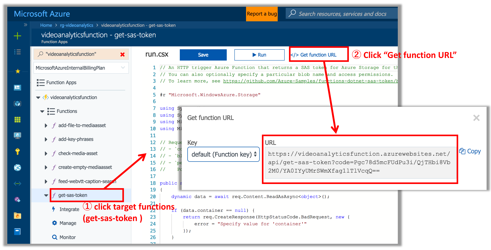
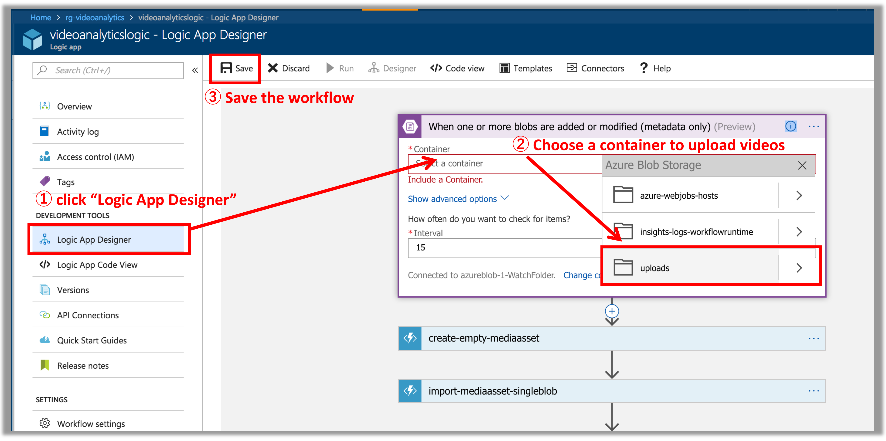
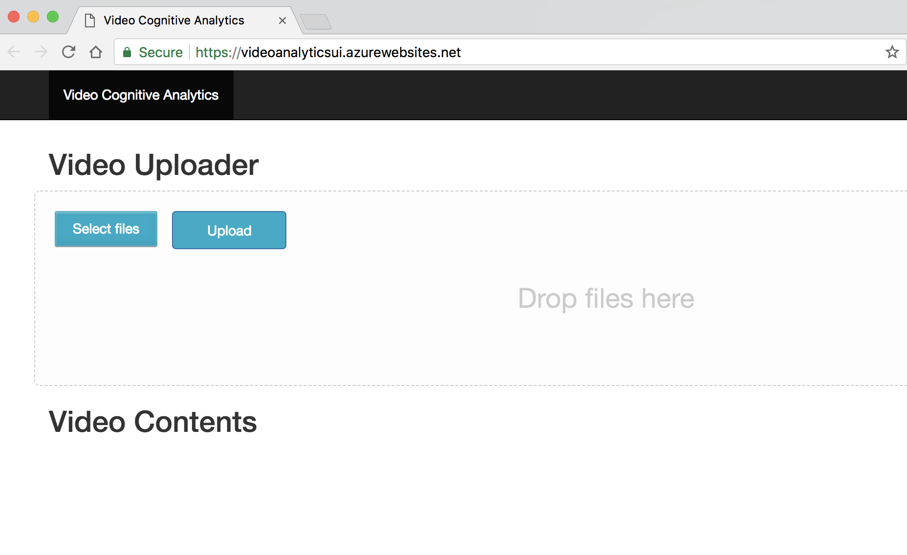
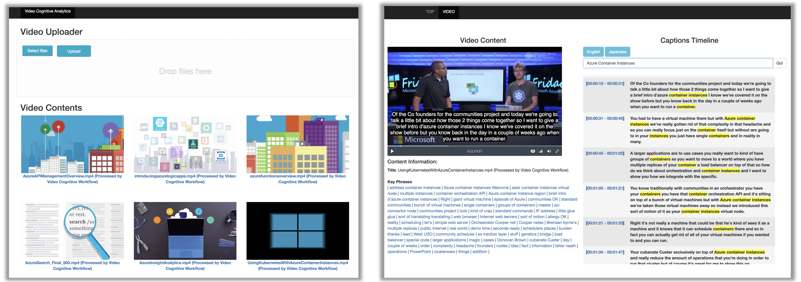

# How to deploy the demo application

## Prerequisites
You can run this walkthrough on OS X, Linux (Cloud Shell Bash), or Bash on Windows. 

- You need an Azure subscription. If you don't have one, you can [sign up for an account](https://azure.microsoft.com/).
- Install the [Azure CLI 2.0](https://docs.microsoft.com/en-us/cli/azure/install-azure-cli?view=azure-cli-latest)
```
pip install -U azure-cli
``` 
[NOTE] you can skip azure-cli installation if you execute bash commands from [Azure Cloud Shell](https://docs.microsoft.com/en-us/azure/cloud-shell/overview)


## Create Resources and Deploy applications

### 1. Create Resource Group
Create resource group for the demo (Resource group named `rg-videoanalytics` in `japanwest` region):
```
az group create --name rg-videoanalytics --location japaneast
```

### 2. Clone the project source code from Github and edit videoanalytics.conf

Clone the project source code from Github
```
git clone https://github.com/yokawasa/azure-serverless-video-analytics.git
```

Then, open videoanalytics.conf and add values for the following variables in the file. 
- azure-serverless-video-analytics/scripts/[videoanalytics.conf](../scripts/videoanalytics.conf)
```
...
# Commons
ResourceGroup="<Resource group for the project>"
ResourceLocation="<Resource Region name (ex. japaneast)>"

# Storage Account attached to Azure Media Services
AMSStorageAccountName="<Storage Account Name that is attached to Azure Media Service>"

# Storage Account for Video data source (you upload videos to this storage)
SourceStorageAccountName="<Video Source Storage Account Name>"
...
```
[NOTE] Your storage account names must be unique within Azure. 

### 3. Create and configure Azure Storage Account for uploading and processing video sources

Create Azure Storage Account for uploading and processing video sources, add a blob container as a video uploading endpoint, and configure CORS for the account by running a following scirpt:
```
scripts/create-configure-source-storage.sh
```
After the storage account is created, obtain storage access key either in Azure Portal or Azure CLI. The key is used in later steps.

### 4. Create Azure Storage Account for Azure Media Services

Create Azure Storage Account for Azure Media Services by running a following scirpt:
```
scripts/create-configure-ams-storage.sh
```
After the storage account is created, obtain storage access key either in Azure Portal or Azure CLI. The key is used in later steps.

### 5. Create Azure Media Services Account and Service Principal for accessing Media Services API 

Create a Media Services account by using the Azure portal, the .NET SDK, or the REST API. 
- [Create an Azure Media Services account using the Azure portal](https://docs.microsoft.com/en-us/azure/media-services/media-services-portal-create-account)

Setting points:
- Media Services Account Name: specify any name
- Storage Account Name: specify the storage account that you create in step 4
- Storage Option: `Starndard_LSR` is enough for the sample application

After the Media Service account is created, create a Service Principal and save the password. It will be needed in later steps.

- [Service principal authentication for Azure Media Services](https://docs.microsoft.com/en-us/azure/media-services/media-services-portal-get-started-with-aad#service-principal-authentication)

 The corresponding variables in [videoanalytics.conf](../scripts/videoanalytics.conf) are:
```
AMSAADTenantDomain="<Azure Media Service AAD Tenant Domain>"
AMSRESTAPIEndpoint="<Azure Media Service REST API Endpoint>"
AMSClientId="<Azure Media Services Account Service Principal Client Id>"
AMSClientSecret="<Azure Media Services Account Service Principal Client Secret>"
```

### 6. Start Azure Media Services streaming endpoint
To enable streaming, go to the Azure portal, select the Azure Media Services account which has been created, and start the default streaming endpoint.

### 7. Create CosmosDB Account (SQL API)

Creates an Azure Cosmos DB API account for use with the SQL API with either [the Azure portal](https://docs.microsoft.com/en-us/azure/cosmos-db/tutorial-develop-sql-api-dotnet#create-an-azure-cosmos-db-account), Languages SDK / REST API, or [Azure CLI](https://docs.microsoft.com/en-us/azure/cosmos-db/scripts/create-database-account-collections-cli). Here is an Azure CLI command to create Cosmos DB account (name: `videoanalytics` ) for SQL API 

```
az cosmosdb create \
    --name videoanalytics \
    --kind GlobalDocumentDB \
    --resource-group rg-videoanalytics
```

After the Cosmos DB account is created, obtain Read-Write Key either in Azure Portal or Azure CLI. The key is used in later steps. Here is an Azure CLI command to get Read-Write primary key for Cosmos DB account name `videoanalytics`:
```
az cosmosdb list-keys --name videoanalytics --resource-group rg-videoanalytics |grep primaryMasterKey

(OUTPUT)
  "primaryMasterKey": "j1EeL29LGjvUQQ9H1GKDCpegc9eOuQl1PoJwUduJkwSZd7h9rpU1B7EwoegnFQ2JnYDdmRfaJAYkmSgAGhuKbQ==",
```

### 8. Create Azure Search Service Account

Create an Azure Search service with either [the Azure Portal](https://docs.microsoft.com/en-us/azure/search/search-create-service-portal) or Languages SDK / REST API.

Setting points:
- Sku: basic is enough for the sample app
- Replica Count: 1 is enough for the sample app
- Partition Count: 1 is enough for the sample app
- Hosting Mode: default is enough for the sample app

After the Azure Search account is created, obtain PRIMARY ADMIN KEY in Azure Portal. The key is used in later steps.

### 9. Sign up for the Microsoft Translator Text API

Sign up for `the Microsoft Translator Text API` in the Azure Portal
- [How to sign up for the Microsoft Translator Text API](https://docs.microsoft.com/ja-jp/azure/cognitive-services/translator/translator-text-how-to-signup
)

Retrieve API key in the Azure Portal.  The key is used in later steps

### 10. sign up for the Text Analytics API

Sign up for `the Text Analytics API` in the Azure Portal
- [How to sign up for Text Analytics API](https://docs.microsoft.com/ja-jp/azure/cognitive-services/text-analytics/how-tos/text-analytics-how-to-signup)

Retrieve API key and API region/location name in the Azure Portal.  The key is used in later steps

### 11. Edit videoanalytics.conf

Open videoanalytics.conf and add all related services infomation to the file. The videoanalytics.conf is used in later steps. 
- azure-serverless-video-analytics/scripts/[videoanalytics.conf](../scripts/videoanalytics.conf)

Please refer to example configurations too: [videoanalytics.conf.example](../scripts/videoanalytics.conf.example)

### 12. Create Azure Search Schema
Create Azure Search schemas in Azure Search Account that created in step 6 by running a following scirpt:

```
scripts/create-azuresearch-schema.sh
```
[NOTE] The script above creates 2 indexes in the Azure search account: `caption-ja` & `caption-en`

### 13. Deploy Azure Functions

Create Azure Functions Account and deploy functions apps into the account by running a following scirpt:
```
scripts/deploy-functions.sh
```

### 14. Get Function URLs and update videoanalytics.conf

Get the following functions' URLs (scheme + host/path + query) in the Azure Portal:
- get-sas-token
- http-to-translator-queue

Here is how you get get-sas-token function's URL.


Once you get both `get-sas-token` and `http-to-translator-queue` function URL, replace `SasTokenAPIEndpoint` value with `get-sas-token` function URL and replace `WebhookSubscribeAPIEndpoint` value with `http-to-translator-queue` function URL in `videoanalytics.conf` like this:
```
SasTokenAPIEndpoint="https://videoanalyticsfunction.azurewebsites.net/api/get-sas-token?code=xug1a3GJ3zBkb4n36PKQsnAkOBeZeCEgy2insxE4KfhoRqN1AtZLMw=="

WebhookSubscribeAPIEndpoint="https://videoanalyticsfunction.azurewebsites.net/api/http-to-translator-queue?code=SCDWYSgQNasvYbM0Akkqe4k8o9p9KBxGALTKpKnmoR0ToKbuC95fDg=="
```

### 15. Deploy Azure Logic App

Create Azure Logic App Account and deploy a workflow to the account by running a following scirpt:
```
scripts/deploy-logicapp.sh
```

### 16. Configure Azure Blob API Connector in the Logic App
Open Logic App Designer in Logic app that you've just deployed, choose a video uploading container for Azure Blob API Connector ('uploads' by default), then save it just like this:




### 17. Deploy Azure Web App (Web UI)

Create Azure Web App Account and deploy an app into the account by running a following scirpt:
```
# Deploying web app into Windows Web App with Free App Service plan(SKU F1)
scripts/deploy-webapp.sh
```
If you want to deploy a container based app into Web App for Container, run `deploy-webapp-linux.sh` instead of `deploy-webapp.sh`. But please be noted that Web App for Container need at least `SKU S1` App Service Plan

## Access to Web UI and Upload Sample Videos

Access to the deployed web app, and you'll see the following site page
```
open https://<WebAppName>.azurewebsites.net
```



Then, upload your sample vidoe (ie, mp4 files) with Video Uploader in the UI. The Video contents will come up when video analytics pipeline has completed.




## Delete all resources for the sample app (only if needed)
```
scripts/delete-resources.sh
```

 
